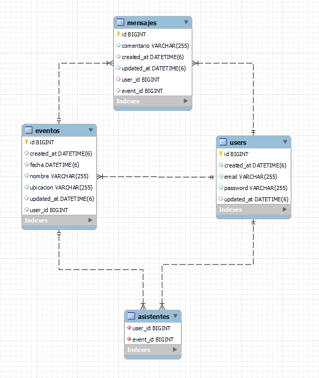

# Login y Registro de Usuarios

### API para servir datos y tambien modelo MVC. Los usuarios se registran, se autentican, pueden crear eventos, marcar si asistirán y dejar comentarios validando el propietario para las acciones.

### Este proyecto se complementa con la aplicación de react native para poder operar el sistema de manera multiplataforma.

### Puede ver la aplicación mobile en el siguiente link:

 <a href="https://github.com/javierhuebra/App_Mobile_LoginRegistro_Native_Spring">Ver el proyecto React Native para mobile</a>
    
 

### El back sigue estas relaciones: 

  

